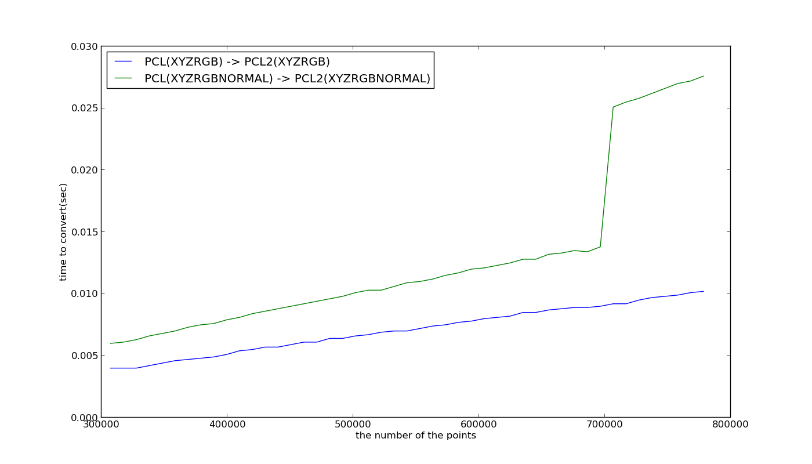
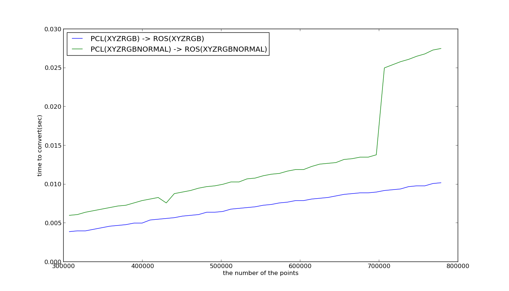
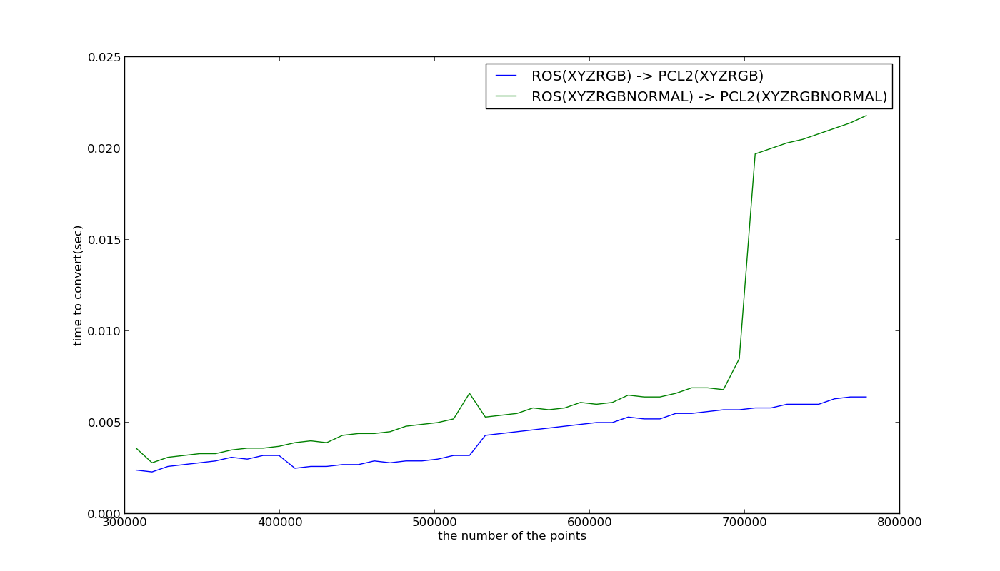
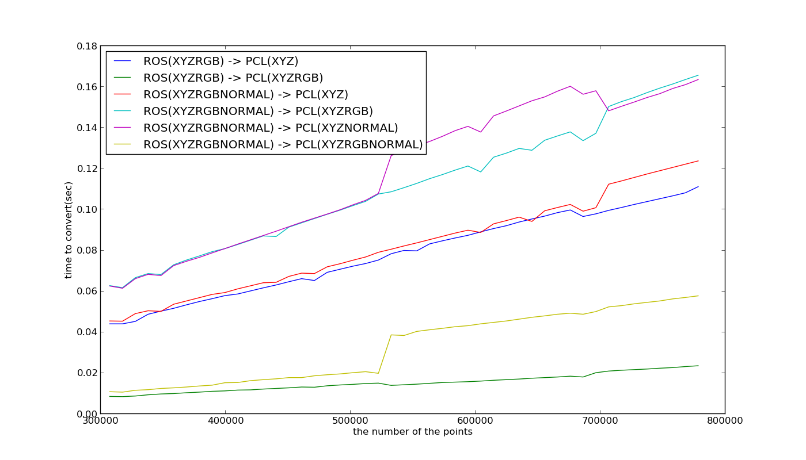
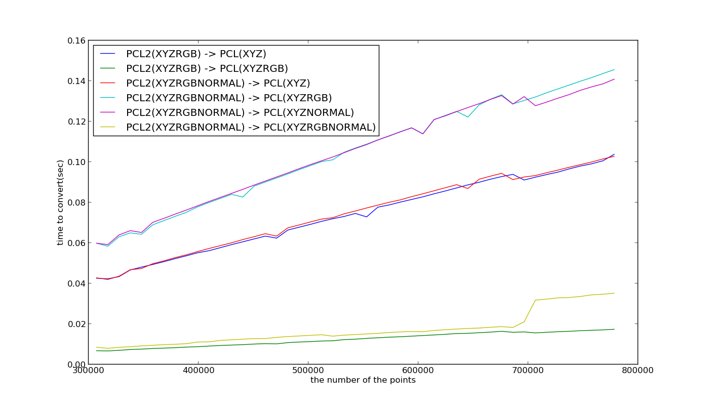
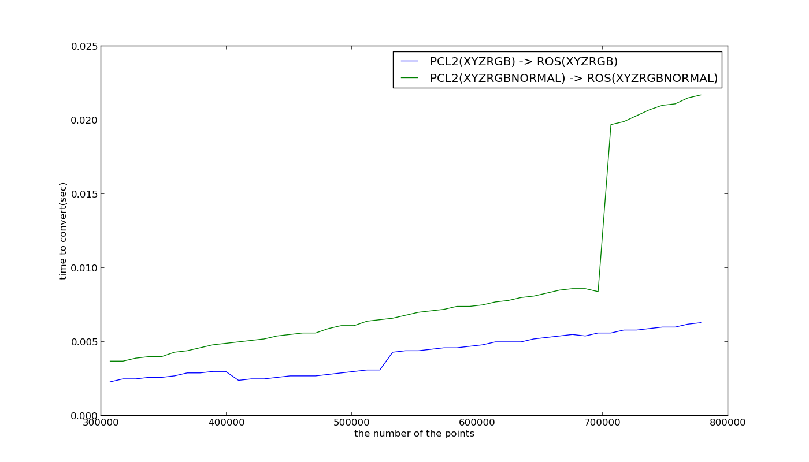

pcl_ros_conversion_benchmark
============================

benchmark of pcl-ros conversion

# classes
* `sensor_msgs::PointCloud2` pointcloud message type used in ROS
* `pcl::PointCloud<PointT>` pointcloud message type used in PCL
* `pcl::PCLPointCloud2` it's just a PCL version of `sensor_msgs::PointCloud2`. In order to be independent from ROS, PCL have their own pointcloud type
which is compatible with `sensor_msgs::PointCloud2`.

The problems comes from `PointT` template argument of `pcl::PointCloud`. When we convert `sensor_msgs::PointCloud2`
and `pcl::PCLPointCloud2` to `pcl::PointCloud<PointT>`, we can decrease the fields of the points.
For example, though `pcl::PCLPointCloud2` has rgb field, we can convert it to `pcl::PointCloud<PointXYZ>` only
with x, y and z fields.

# experiments

# conclusions
If you want to convert `sensor_msgs/PointCloud2` and `pcl::PCLPointCloud2` to `pcl::PointCloud`, you
should not decrease the fields of the points.
If the input pointcloud has x, y, z and rgb, you should convert it to `PointXYZRGB`.

For example, when we have a pointcloud from kinect (VGA and the fields are x, y, z and rgb),
it costs around 0.02 sec to convert the pointclouds from ROS to PCL and from PCL to ROS.
If your pointcloud processing takes 0.03sec (= 30fps), summation of the processing and conversion will be
0.05sec (= 20fps).

OTH, there is a huge *jump* around 700k points in several experiments. We need to dig this issue more to address
the reason but cache contamination is a potential reason of this problem.
