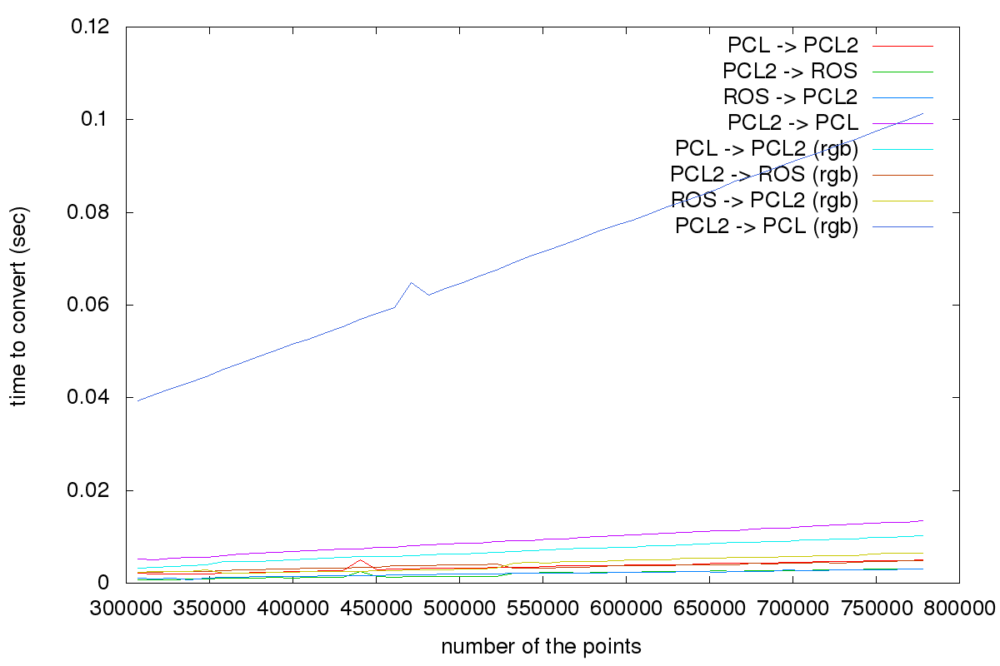

pcl_ros_conversion_benchmark
============================

benchmark of pcl-ros conversion

# classes
* `sensor_msgs::PointCloud2` pointcloud message type used in ROS
* `pcl::PointCloud<PointT>` pointcloud message type used in PCL
* `pcl::PCLPointCloud2` it's just a PCL version of `sensor_msgs::PointCloud2`. In order to be independent from ROS, PCL have their own pointcloud type
which is compatible with `sensor_msgs::PointCloud2`.

In order to convert from `sensor_msgs::PointCloud2` to `pcl::PointCloud`, we need to across `pcl::PCLPointCloud2`

# experiment
`pcl_ros_conversion_benchmark.cpp` tests two kinds of pointcloud which are X-Y-Z and X-Y-Z-RGB.
`pcl_ros_conversion_benchmark.cpp` measures following conversions and output the time as the average of 100 times testing:
* `pcl::PointCloud` -> `pcl::PCLPointCloud2`
* `pcl::PCLPointCloud2` -> `sensor_msgs::PointCloud2`
* `sensor_msgs::PointCloud2` -> `pcl::PCLPointCloud2`
* `pcl::PCLPointCloud2` -> `pcl::PointCloud`

# conclusion
If we have a pointcloud with X, Y, Z and RGB field, it takes much time to convert from `pcl::PCLPointCloud2` to `pcl::PointCloud`. It means that converting from `sensor_msgs::PCLPointCloud2` to `pcl::PointCloud` also takes a long time.

